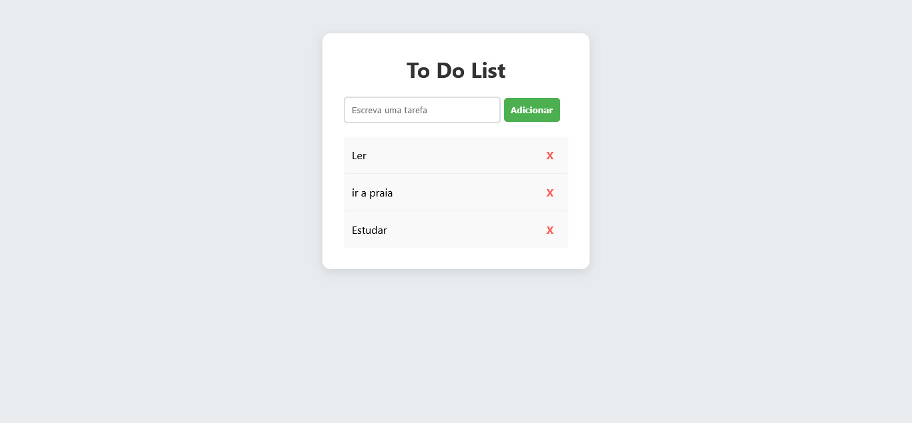

# 🚀 Do-to-List

<p align="center">
  

</p>

> **Status do Projeto:** ⚠️ Em Desenvolvimento

## 📌 Sobre o Projeto

O Do to List foi pensado e desenvolvido para armazenar listas de tarefas simples do dia a dia otimizando, tempo e mantendo o foco no que realmente importa. Esse Sistema ainda está em processo de desenvolvimento, iniciei para colocar em pratica o que venho estudando, quem sabe no futuro possa se torna algo grande.

O design foi pensado para ser limpo e moderno, utilizando a paleta de cores em **verde (#4caf50)** e **Branco (#ffff)**, garantindo um contraste vibrante e profissional.

---

## 🛠️ Tecnologias Utilizadas

Este projeto foi construído utilizando as seguintes tecnologias:

- **HTML5:** Estruturação semântica do conteúdo.
- **CSS3:** Estilização com foco em responsividade e na tipografia
- **JavaScript (ES6+):** Lógica de programação e interatividade.

---

## 🎨 Identidade Visual (UI/UX)

Para manter a consistência visual, o projeto segue as diretrizes:

- **Tipografia:** Open Sans (Google Fonts)
- **Cores principais:**
  - `#4caf50` (Verde) - Usado para botões de ação e destaques.
  - `#FFFFFF` (Branco) - Usado para cabeçalhos e elementos estruturais.

---

## 🚀 Como Executar o Projeto

Para visualizar este projeto localmente, siga os passos abaixo:

1.  **Clone o repositório:**
    ```bash
    git clone [https://github.com/seu-usuario/seu-repositorio.git](https://github.com/seu-usuario/seu-repositorio.git)
    ```
2.  **Navegue até a pasta:**
    ```bash
    cd seu-repositorio
    ```
3.  **Abra o arquivo principal:**
    Basta abrir o arquivo `index.html` em seu navegador de preferência ou utilizar a extensão _Live Server_ do VS Code.

---


## 👤 Autor

Desenvolvido por **José-DEV**.

[](https://www.linkedin.com/in/jose-antonio-luz)

